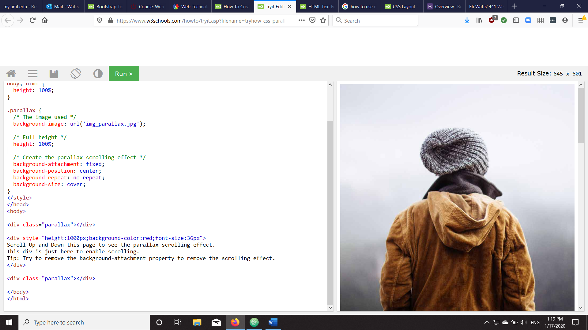

# Eli Watts
# MART 441
# Homework Assignment 1

## Intro
When starting this week’s homework assignment, I was a little worried. Assignment 1 required the use of techniques I had not yet learned, like breakpoints, mobile-first, and web-responsive-design. While I was unable to get everything working the way I wanted, I am happy that I was able to include some web-responsive-design foundations into my webpage.

## What Worked?

Despite never having heard of the term breakpoints or Bootstrap, I was able to use both in my web page. First, I added the Bootstrap library links in my `index.html` header. Then, I established a 1:1 relationship between CSS pixels and device-independent pixels with the `viewport` meta element. Having done that, I was able to experiment with Bootstrap’s formatting capabilities. I used Bootstraps `container-fluid` element to create containers for text that stretched the entire width of the viewport. To make the text within the container more legible I used my CSS stylesheet and media queries to control each container’s width. For devices wider than 991.98px the `container-fluid` element has a width of 50% of the device’s screen. For devices narrower than 767.98px the `container-fluid` element has a width of 85% of the device’s screen. For devices narrower than 575.98px the `container-fluid` element has a width of 90% of the device’s screen.

To better accommodate for portrait style screens, I used the `picture` element to change my webpages image from a landscape formatted picture, to a portrait formatted picture when the devices screen width drops below 768px. The Bootstrap `row` element also stacks the individual links on top of each other when the screen width decreases to 768px which makes navigation easier for narrower screens.

Other techniques, like downloading and linking to external fonts, that I learned in MART 341 worked well in this project.

## What Didn’t Work?

Positioning was difficult for me in MART 341 and it was difficult for me in this assignment too. Using CSS, I wanted to use absolute positioning for my navbar but doing so moved it from being centered to being left justified. All the formatting provided by the Bootstrap library also disappeared when I modified my navbar in my CSS stylesheet.

I like the parallax scrolling effect and I thought it would fit well on my webpage. However, I was unable to make it work. I looked at the example code on the W3 school, but it used a CSS technique I am unfamiliar with. In the screenshot, the image URL is written out in CSS rather than HTML. I have always used the HTML `img` or `picture` elements to add images to my webpages. I was unable to create a parallax effect using HTML.

While I am very happy that my webpage image changes when the device’s screen width shrinks, I was unable to get some of the finer details to work. While the image changes, the alt text and title text do not. Therefore, the second picture, the fly, is mistitled. This is my first time using the `picture` element which may be why I don’t fully understand it.

Finally, although I did have some success using Bootstrap, I was unable to use a downloaded version of Bootstrap. Instead, I have been relying on links to the Bootstrap Content Librabry in my HTML document header. Trying to understand how to use a downloaded version of Bootstrap led me down a rabbit hole of terms like node package manager that I was not able to understand. Hopefully that will change by the end of the semester!
