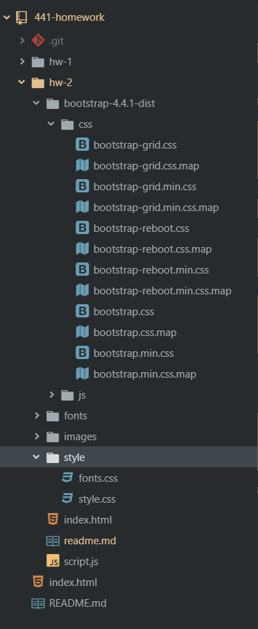

# Eli Watts
# MART 441
# Homework Assignment 2

## Intro

As I have taken a class on P5.js, a JavaScript library for creative coding, this weeks assignment was fairly straight forward. In my past experiences with coding classes, I have often struggled when concepts start to become more complex. So, I am greatful for the opprotunity to review some of the basics.

## What Worked?

Creating and  then linking to the external JavaScript document in my HTML document was no problem. Similarly, using the `.log` method with the `console` object to add comments to my webpage's console was also no problem.

As I had some extra time I also decided to try and use the downloaded version of Bootstrap rather than internet dependent links in my HTML header. While I was able to download Bootstrap succesfully and to add it to the same directory in which I stored my HTML document, it did create some problems which I will describe in the next section.

## What Didn’t Work?

Using the downloaded version of Bootstrap rather than the internet dependent links, which I used last assignment, changed some of my website's formatting. In particular, my navbar changed from three inline links, to three vertically stacked links. I think this may be because of how my stylesheets are organized. The screenshot below shows how my current directory is laid out. When I added the bootstrap-4.4.1-dist folder it also added a couple CSS stylesheets, which I think may be conflicting with my existing stylsheets. I'm not sure if consolidating my CSS stylsheets into the Bootstrap stylesheets would fix my problem. 

